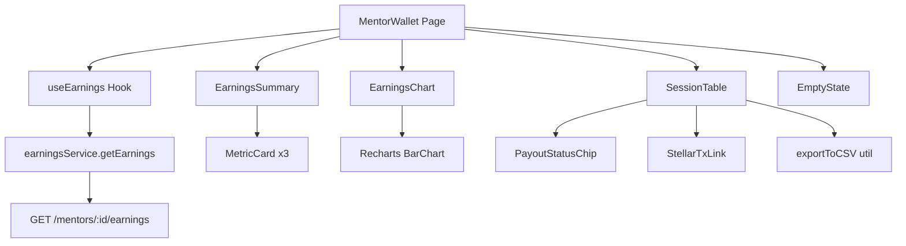

# Design Document: Mentor Earnings & Payout Dashboard

## Overview

The Mentor Earnings & Payout Dashboard replaces the current placeholder `MentorWallet` page at `/mentor/wallet` with a fully functional earnings experience. It surfaces data from the existing `GET /mentors/:id/earnings` backend endpoint through four main UI areas: summary metric cards, a time-series bar chart, a per-session breakdown table, and Stellar transaction hash links.

The feature is built entirely on the existing React + TypeScript + Tailwind + Recharts stack. No new dependencies are required. The design follows the established patterns in the codebase: a custom hook owns all data-fetching and business logic, a service module handles API calls, and presentational components are composed in the page.

### Key Design Decisions

- **No new dependencies**: Recharts (already installed) handles the bar chart. The existing `exportToCSV` utility in `src/utils/export.utils.ts` handles CSV export.
- **Replace, don't extend**: `MentorWallet.tsx` is replaced wholesale rather than patched, keeping the old placeholder code out of the new implementation.
- **Single data-fetch hook**: `useEarnings` owns the API call, derived state (summary totals, chart series, sorted/paginated table rows), loading/error state, and export logic. Components receive only what they need via props.
- **Client-side aggregation**: Weekly/monthly chart series are computed from the raw session array returned by the API, avoiding a second endpoint.
- **Optimistic cache**: The hook stores the last successful response in a `useRef` so navigating away and back within the same session shows data immediately while a background refresh runs.

---

## Architecture



Data flows in one direction: the page mounts, `useEarnings` fires the API call, and derived state propagates down to each child component via props. There is no shared context for this feature — the hook is the single source of truth.

---

## Components and Interfaces

### Page: `MentorWallet` (replaced)
**Path**: `src/pages/MentorWallet.tsx`

Orchestrates the layout. Calls `useEarnings`, passes slices of state to child components. Renders `EmptyState` when there are no sessions, otherwise renders `EarningsSummary`, `EarningsChart`, and `SessionTable`.

### Hook: `useEarnings`
**Path**: `src/hooks/useEarnings.ts`

```typescript
interface UseEarningsReturn {
  summary: EarningsSummaryData | null;
  chartSeries: ChartSeries[];
  sessions: MentorPayoutSession[];
  totalSessions: number;
  loading: boolean;
  error: string | null;
  retry: () => void;
  // Chart controls
  chartRange: 'weekly' | 'monthly';
  setChartRange: (range: 'weekly' | 'monthly') => void;
  // Table controls
  page: number;
  setPage: (page: number) => void;
  sortKey: SortKey;
  sortDir: 'asc' | 'desc';
  setSort: (key: SortKey) => void;
  // Export
  exportCSV: () => void;
}
```

### Service: `earningsService`
**Path**: `src/services/earnings.service.ts`

```typescript
export async function getEarnings(mentorId: string): Promise<EarningsApiResponse>
```

Calls `GET /mentors/:id/earnings` via the existing `api` client. Returns the raw API response; all transformation happens in the hook.

### Component: `EarningsSummary`
**Path**: `src/components/earnings/EarningsSummary.tsx`

Renders three `MetricCard` instances (reusing the existing component). Accepts `summary: EarningsSummaryData | null` and `loading: boolean`. Shows skeleton cards when `loading` is true.

### Component: `EarningsChart`
**Path**: `src/components/earnings/EarningsChart.tsx`

Wraps a Recharts `BarChart`. Accepts `series: ChartSeries[]`, `range: 'weekly' | 'monthly'`, and `onRangeChange`. Renders a toggle (Weekly / Monthly) and the bar chart with tooltip and y-axis currency label.

### Component: `SessionTable`
**Path**: `src/components/earnings/SessionTable.tsx`

Paginated table (20 rows/page). Accepts `sessions`, `page`, `totalSessions`, `sortKey`, `sortDir`, `onSort`, `onPageChange`, `onExport`. Renders `PayoutStatusChip` and `StellarTxLink` per row.

### Component: `PayoutStatusChip`
**Path**: `src/components/earnings/PayoutStatusChip.tsx`

Badge with colour-coded label. Accepts `status: PayoutStatus` and optional `estimatedReleaseDate`. Shows a tooltip on hover for pending sessions.

### Component: `StellarTxLink`
**Path**: `src/components/earnings/StellarTxLink.tsx`

Renders a truncated hash link or a dash. Accepts `txHash: string | null | undefined`. Constructs the Stellar Expert URL and opens in a new tab with `rel="noopener noreferrer"`.

### Component: `EmptyState`
**Path**: `src/components/earnings/EmptyState.tsx`

Zero-data view. Accepts no data props. Renders icon, heading, description, and a link to `/mentor/sessions`.

---

## Data Models

### API Response Shape

The `GET /mentors/:id/earnings` endpoint is expected to return:

```typescript
interface EarningsApiResponse {
  summary: {
    totalAllTimeNet: number;
    pendingEscrow: number;
    thisMonthNet: number;
    currency: string; // e.g. "USDC"
  };
  sessions: RawPayoutSession[];
}

interface RawPayoutSession {
  sessionId: string;
  sessionDate: string;          // ISO 8601
  menteeName: string;
  durationMinutes: number;
  grossAmount: number;
  platformFee: number;
  netPayout: number;
  asset: string;                // e.g. "USDC"
  payoutStatus: 'pending' | 'completed' | 'failed';
  txHash?: string;              // present when payoutStatus === 'completed'
  estimatedReleaseDate?: string; // ISO 8601, present for pending
}
```

### Frontend Types

**Path**: `src/types/earnings.types.ts`

```typescript
export type PayoutStatus = 'pending' | 'completed' | 'failed';
export type SortKey = 'sessionDate' | 'grossAmount' | 'netPayout';
export type ChartRange = 'weekly' | 'monthly';

export interface EarningsSummaryData {
  totalAllTimeNet: number;
  pendingEscrow: number;
  thisMonthNet: number;
  currency: string;
}

export interface MentorPayoutSession {
  sessionId: string;
  sessionDate: string;
  menteeName: string;
  durationMinutes: number;
  grossAmount: number;
  platformFee: number;
  netPayout: number;
  asset: string;
  payoutStatus: PayoutStatus;
  txHash?: string;
  estimatedReleaseDate?: string;
}

export interface ChartSeries {
  label: string;       // e.g. "Mar '25" or "W12 2025"
  netPayout: number;
}
```

### Chart Aggregation Logic

**Weekly**: Group sessions by ISO week number + year. Show the 12 most recent weeks. Weeks with no sessions get a `netPayout: 0` entry.

**Monthly**: Group sessions by `YYYY-MM`. Show the 12 most recent calendar months. Months with no sessions get a `netPayout: 0` entry.

The majority-currency label for the y-axis is determined by summing `netPayout` per `asset` across all sessions and picking the asset with the highest total.

### CSV Export Format

Filename: `mentor-earnings-{YYYY-MM-DD}.csv` (current date at export time).

Columns (in order): `Date`, `Mentee Name`, `Duration (min)`, `Gross Amount`, `Platform Fee`, `Net Payout`, `Asset`, `Payout Status`, `Transaction Hash`.

Rows reflect the currently sorted session list (all pages, not just the visible page).

### Transaction Hash Display

Truncation formula: `${hash.slice(0, 8)}…${hash.slice(-4)}`

Stellar Explorer URL: `https://stellar.expert/explorer/public/tx/${txHash}`


---

## Correctness Properties

*A property is a characteristic or behavior that should hold true across all valid executions of a system — essentially, a formal statement about what the system should do. Properties serve as the bridge between human-readable specifications and machine-verifiable correctness guarantees.*

### Property 1: Summary values match API data

*For any* valid `EarningsApiResponse`, when the `EarningsSummary` component is rendered with that data, the displayed values for "Total Earned (All Time)", "Pending Payouts", and "This Month's Earnings" must equal `summary.totalAllTimeNet`, `summary.pendingEscrow`, and `summary.thisMonthNet` respectively.

**Validates: Requirements 1.3**

---

### Property 2: Chart aggregation always produces 12 data points

*For any* session array and chart range (`'weekly'` or `'monthly'`), the aggregation function must return exactly 12 data points covering the 12 most recent periods. Periods with no sessions must appear with `netPayout: 0` rather than being omitted.

**Validates: Requirements 2.3, 2.4, 2.7**

---

### Property 3: Majority-currency y-axis label

*For any* session array, the currency selected for the y-axis label must be the asset code whose sessions sum to the highest total `netPayout`. If all totals are equal, any consistent tie-breaking rule is acceptable.

**Validates: Requirements 2.6**

---

### Property 4: All sessions appear in the table with all required fields

*For any* session array returned by the API, every session must appear as a row in the `SessionTable`, and each row must render: session date, mentee name, duration in minutes, gross amount with asset code, platform fee with asset code, net payout with asset code, and a `PayoutStatusChip`.

**Validates: Requirements 3.1, 3.2**

---

### Property 5: Pagination shows at most 20 rows per page

*For any* session array of length N and any page number P, the slice of sessions rendered on page P must contain at most 20 rows.

**Validates: Requirements 3.3**

---

### Property 6: Sort produces a correctly ordered sequence and is reversible

*For any* session array and any sortable key (`sessionDate`, `grossAmount`, `netPayout`), sorting ascending must produce a non-decreasing sequence by that key, and sorting descending must produce a non-increasing sequence. Sorting ascending then descending must return the same set of sessions (round-trip).

**Validates: Requirements 3.4**

---

### Property 7: Amount formatting includes asset code

*For any* session with a numeric amount and an asset string, the rendered amount string must contain both the numeric value (formatted to 2 decimal places) and the asset code (e.g. `"114.00 USDC"`).

**Validates: Requirements 3.5**

---

### Property 8: PayoutStatusChip label matches payout status

*For any* session with a `payoutStatus` of `'completed'`, `'pending'`, or `'failed'`, the `PayoutStatusChip` must render the label `"Paid"`, `"Pending"`, or `"Failed"` respectively, with the corresponding colour class (`green`, `yellow`, `red`).

**Validates: Requirements 3.6, 3.7, 3.8**

---

### Property 9: Pending chip tooltip shows release date or fallback

*For any* pending session, the `PayoutStatusChip` tooltip text must equal the `estimatedReleaseDate` (formatted as a human-readable date) when that field is present, or the string `"Release date pending session confirmation"` when it is absent.

**Validates: Requirements 4.3**

---

### Property 10: Transaction hash truncation

*For any* non-empty `txHash` string of length ≥ 12, the truncated display must equal `txHash.slice(0, 8) + "…" + txHash.slice(-4)`.

**Validates: Requirements 5.1**

---

### Property 11: Stellar Explorer URL construction

*For any* `txHash` string, the constructed Stellar Explorer URL must equal `https://stellar.expert/explorer/public/tx/${txHash}`.

**Validates: Requirements 5.3**

---

### Property 12: Transaction hash link security attributes

*For any* rendered `StellarTxLink` with a non-null `txHash`, the anchor element must have `rel` containing both `"noopener"` and `"noreferrer"`, and `target="_blank"`.

**Validates: Requirements 5.5**

---

### Property 13: Empty-to-populated state transition

*For any* `useEarnings` state that transitions from an empty sessions array to a non-empty sessions array (simulating a data refresh), the rendered output must switch from showing `EmptyState` to showing `SessionTable` and `EarningsChart` without requiring a page reload.

**Validates: Requirements 6.5**

---

### Property 14: CSV export content matches session data

*For any* session array (with any active sort), the exported CSV must: (a) have a header row containing exactly the columns `Date`, `Mentee Name`, `Duration (min)`, `Gross Amount`, `Platform Fee`, `Net Payout`, `Asset`, `Payout Status`, `Transaction Hash`; and (b) have one data row per session, with values matching the session fields in the same order as the sorted session list.

**Validates: Requirements 7.2, 7.3**

---

### Property 15: CSV filename includes current date

*For any* export triggered on a given calendar date, the downloaded filename must match the pattern `mentor-earnings-YYYY-MM-DD.csv` where `YYYY-MM-DD` is the ISO date string of the current date at export time.

**Validates: Requirements 7.4**

---

## Error Handling

### API Failure
When `GET /mentors/:id/earnings` returns a non-2xx response or the network request rejects, `useEarnings` sets `error` to a user-friendly message and `loading` to `false`. The page renders an inline error banner with a "Retry" button that calls `retry()`, which re-fires the API call and resets `error` to `null` and `loading` to `true`.

The existing `api.error.handler.ts` is used to normalise error responses into a consistent message string.

### Empty / Null Fields
- `txHash` absent on a completed session: `StellarTxLink` renders `"—"`.
- `estimatedReleaseDate` absent on a pending session: tooltip shows the fallback string.
- `summary` null during initial load: `EarningsSummary` renders skeleton cards.

### Pagination Boundary
If `setPage` is called with a value outside `[1, Math.ceil(totalSessions / 20)]`, the hook clamps it to the valid range.

### Export with Zero Rows
When `sessions.length === 0`, the "Export CSV" button is `disabled` and has a `title` attribute of `"No data to export"` (rendered as a native tooltip).

---

## Testing Strategy

### Dual Testing Approach

Both unit tests and property-based tests are required. They are complementary:
- Unit tests cover specific examples, integration points, and edge cases.
- Property tests verify universal correctness across all valid inputs.

### Property-Based Testing Library

**Library**: `fast-check` (to be added as a dev dependency: `npm install -D fast-check`)

Each property test runs a minimum of **100 iterations** (fast-check default). Each test is tagged with a comment referencing the design property.

Tag format: `// Feature: mentor-earnings-payout-dashboard, Property {N}: {property_text}`

### Property Tests

Each correctness property from the section above maps to exactly one property-based test:

| Property | Test file | Arbitraries |
|---|---|---|
| P1: Summary values match API data | `useEarnings.pbt.test.ts` | `fc.record({ totalAllTimeNet: fc.float(), pendingEscrow: fc.float(), thisMonthNet: fc.float(), currency: fc.string() })` |
| P2: Chart aggregation produces 12 points | `chartAggregation.pbt.test.ts` | `fc.array(sessionArbitrary)`, `fc.constantFrom('weekly', 'monthly')` |
| P3: Majority-currency label | `chartAggregation.pbt.test.ts` | `fc.array(sessionArbitrary, { minLength: 1 })` |
| P4: All sessions in table with all fields | `SessionTable.pbt.test.tsx` | `fc.array(sessionArbitrary)` |
| P5: Pagination max 20 rows | `SessionTable.pbt.test.tsx` | `fc.array(sessionArbitrary, { minLength: 21 })`, `fc.integer({ min: 1 })` |
| P6: Sort correctness and round-trip | `sessionSort.pbt.test.ts` | `fc.array(sessionArbitrary)`, `fc.constantFrom('sessionDate', 'grossAmount', 'netPayout')` |
| P7: Amount formatting | `formatAmount.pbt.test.ts` | `fc.float({ min: 0 })`, `fc.constantFrom('USDC', 'XLM', 'PYUSD')` |
| P8: PayoutStatusChip label | `PayoutStatusChip.pbt.test.tsx` | `fc.constantFrom('completed', 'pending', 'failed')` |
| P9: Pending tooltip content | `PayoutStatusChip.pbt.test.tsx` | `fc.option(fc.string())` (estimatedReleaseDate) |
| P10: Hash truncation | `StellarTxLink.pbt.test.tsx` | `fc.string({ minLength: 12 })` |
| P11: Stellar URL construction | `StellarTxLink.pbt.test.tsx` | `fc.string({ minLength: 1 })` |
| P12: Link security attributes | `StellarTxLink.pbt.test.tsx` | `fc.string({ minLength: 12 })` |
| P13: Empty-to-populated transition | `useEarnings.pbt.test.ts` | `fc.array(sessionArbitrary, { minLength: 1 })` |
| P14: CSV content matches sessions | `csvExport.pbt.test.ts` | `fc.array(sessionArbitrary)` |
| P15: CSV filename date | `csvExport.pbt.test.ts` | `fc.date()` |

### Unit Tests

Unit tests live in `src/__tests__/MentorEarningsDashboard.test.tsx` and cover:

- **1.1** — EarningsSummary renders all three card titles
- **1.2** — `earningsService.getEarnings` is called with the authenticated mentor's ID on mount
- **1.4** — Skeleton cards are shown while loading
- **1.5** — Error banner with retry button is shown on API failure
- **2.1** — EarningsChart renders a bar chart element
- **2.2** — Weekly and Monthly toggle options are present
- **4.2** — "Held in escrow — releases after session completion" label is present in the Pending Payouts card
- **5.2** — Transaction hash link opens in a new tab
- **5.4** — Dash is rendered when txHash is absent on a completed session
- **6.1** — EmptyState is shown and table/chart are hidden when sessions is empty
- **6.2** — EmptyState heading "No earnings yet" is present
- **6.3** — EmptyState CTA link points to `/mentor/sessions`
- **6.4** — Summary cards show zero values in empty state
- **7.1** — "Export CSV" button is rendered
- **7.5** — "Export CSV" button is disabled when sessions is empty
