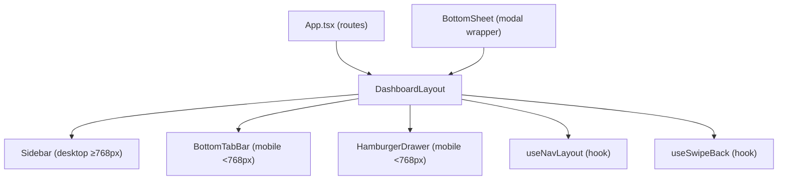

# Design Document: Mobile-Responsive Navigation & Layout

## Overview

This feature refactors `DashboardLayout` and its navigation components to be fully responsive across all screen sizes. The current implementation renders a desktop-only sidebar with no mobile adaptation. The new design introduces a breakpoint-driven layout system: on desktop (≥768px) the existing sidebar is enhanced with avatar, quick stats, and collapse behavior; on mobile (<768px) a bottom tab bar replaces the sidebar, a hamburger drawer handles secondary navigation, and all modals become swipe-dismissible bottom sheets.

The implementation builds on existing primitives already in the codebase — `useMobile`, `useSafeArea`, `TouchGestures`, `MobileModal` — and extends them rather than replacing them.

### Key Design Decisions

- **Single `DashboardLayout` entry point**: Rather than two separate layouts, one component conditionally renders the correct navigation chrome based on viewport width. This avoids route duplication and keeps `App.tsx` unchanged.
- **CSS-first breakpoints via Tailwind**: `md:` prefix handles most show/hide logic, reducing JS-driven layout thrash.
- **`100dvh` over `100vh`**: All full-height containers use `min-h-[100dvh]` with a `-webkit-fill-available` fallback to avoid the iOS Safari chrome-height bug.
- **`viewport-fit=cover` in `index.html`**: Required once at the HTML level to unlock `env(safe-area-inset-*)` CSS variables on iOS.

---

## Architecture

The layout system is structured as a thin composition of focused components, all orchestrated by `DashboardLayout`.



### Breakpoint Strategy

| Viewport | Navigation chrome | Modal style |
|---|---|---|
| ≥768px (md) | Sidebar (left, persistent) | Centered dialog |
| <768px | BottomTabBar + HamburgerDrawer | Full-screen BottomSheet |

The single source of truth for the breakpoint is the Tailwind `md` breakpoint (768px), applied via both CSS classes and the existing `useMobile` hook (`isMobile: window.innerWidth < 768`).

---

## Components and Interfaces

### `DashboardLayout` (refactored)

Replaces the current desktop-only layout. Renders the correct navigation chrome and applies global overflow/height constraints.

```typescript
interface DashboardLayoutProps {
  children: ReactNode;
}
```

Responsibilities:
- Apply `min-h-[100dvh]` with `-webkit-fill-available` fallback
- Apply `overflow-x: hidden` on mobile
- Render `<Sidebar>` hidden on mobile (`hidden md:flex`)
- Render `<BottomTabBar>` hidden on desktop (`flex md:hidden`)
- Render `<HamburgerDrawer>` (controlled by open state)
- Add bottom padding on mobile to account for the tab bar height + safe area
- Mount `useSwipeBack` on detail pages

### `Sidebar` (enhanced)

Extends the existing `src/components/dashboard/Sidebar.tsx`.

```typescript
interface SidebarProps {
  collapsed: boolean;
  onToggleCollapse: () => void;
}
```

New additions over the current implementation:
- User avatar, display name, and role label (from `useAuth`)
- Quick stats section: upcoming sessions count + unread messages count (role-agnostic)
- Active link indicator (already partially present, made consistent)
- Collapse toggle persisted to `localStorage`

### `BottomTabBar`

New component at `src/components/navigation/BottomTabBar.tsx`.

```typescript
interface TabItem {
  id: string;
  label: string;
  icon: React.ReactNode;  // SVG icon component
  to: string;
}

interface BottomTabBarProps {
  tabs: TabItem[];
  onHamburgerPress: () => void;
}
```

- Fixed to bottom of viewport (`fixed bottom-0 left-0 right-0`)
- `padding-bottom: env(safe-area-inset-bottom)` via Tailwind `pb-safe` (requires Tailwind safe-area plugin or inline style)
- Each tab item: min 44×44px hit area, icon + label, active state highlight
- The 5th slot is always "Profile" tab; hamburger icon sits in the top bar, not the tab bar

### `HamburgerDrawer`

New component at `src/components/navigation/HamburgerDrawer.tsx`.

```typescript
interface HamburgerDrawerProps {
  isOpen: boolean;
  onClose: () => void;
  secondaryNavItems: RouteConfig[];
}
```

- Slides in from the left (or slides up as a sheet — left slide chosen for consistency with native patterns)
- Backdrop overlay with `onClick` → close
- `document.body.style.overflow = 'hidden'` while open (scroll lock)
- `useEffect` listening to `popstate` event: if drawer is open, call `onClose()` and `history.pushState` to prevent actual back navigation
- User avatar + name + role at top
- Each nav item: min 44×44px, `NavLink` with active styling

### `BottomSheet` (enhanced)

Extends the existing `src/components/mobile/MobileModal.tsx` `BottomSheet` export.

Additions:
- Drag handle bar at top of sheet on mobile
- Swipe-down-to-dismiss via touch tracking on the handle (reuses `TouchGestures` pattern)
- `padding-top: env(safe-area-inset-top)` when rendered full-screen on mobile
- On desktop (≥768px): renders as a centered dialog instead of a bottom sheet (already supported via `position` prop — wire up automatically based on `isMobile`)

```typescript
// Enhanced BottomSheet auto-selects position based on viewport
interface BottomSheetProps {
  isOpen: boolean;
  onClose: () => void;
  title?: string;
  children: ReactNode;
}
```

### `useSwipeBack` (new hook)

New hook at `src/hooks/useSwipeBack.ts`.

```typescript
interface UseSwipeBackOptions {
  enabled: boolean;          // false on desktop or pages with no history
  edgeThreshold?: number;    // px from left edge to start tracking (default: 30)
  minDisplacement?: number;  // minimum horizontal px to trigger (default: 50)
  minVelocity?: number;      // px/ms threshold (default: 0.3)
}

interface UseSwipeBackReturn {
  swipeProgress: number;     // 0–1, drives visual indicator
  containerProps: {
    onTouchStart: TouchEventHandler;
    onTouchMove: TouchEventHandler;
    onTouchEnd: TouchEventHandler;
  };
}
```

Logic:
1. `touchstart`: record start point only if `touch.clientX <= edgeThreshold`
2. `touchmove`: compute `deltaX`; if `deltaX > 0` and `deltaY < deltaX` (horizontal dominant), update `swipeProgress = deltaX / window.innerWidth`; cancel if scroll container is scrolling horizontally
3. `touchend`: compute velocity = `deltaX / deltaTime`; if `deltaX >= minDisplacement && velocity >= minVelocity` → call `navigate(-1)`; else reset `swipeProgress` to 0

### `useNavLayout` (new hook)

New hook at `src/hooks/useNavLayout.ts` — centralizes drawer open state and sidebar collapse state.

```typescript
interface UseNavLayoutReturn {
  drawerOpen: boolean;
  openDrawer: () => void;
  closeDrawer: () => void;
  sidebarCollapsed: boolean;
  toggleSidebarCollapse: () => void;
}
```

Sidebar collapse state is persisted to `localStorage` key `mm_sidebar_collapsed`.

---

## Data Models

No new backend data models are required. The feature is purely frontend layout and navigation.

### Navigation Config (extended)

The existing `MAIN_NAVIGATION` and `USER_NAVIGATION` from `src/config/routes.config.ts` are reused. The `BottomTabBar` uses a fixed 5-item subset defined inline (not from the route config, since the tab bar is a curated primary-destination list):

```typescript
// src/components/navigation/BottomTabBar.tsx
const MENTOR_TABS: TabItem[] = [
  { id: 'home',     label: 'Home',     icon: <HomeIcon />,     to: '/mentor/dashboard' },
  { id: 'search',   label: 'Search',   icon: <SearchIcon />,   to: '/mentors' },
  { id: 'bookings', label: 'Bookings', icon: <CalendarIcon />, to: '/mentor/sessions' },
  { id: 'messages', label: 'Messages', icon: <MessageIcon />,  to: '/messages' },
  { id: 'profile',  label: 'Profile',  icon: <UserIcon />,     to: '/mentor/profile' },
];

const LEARNER_TABS: TabItem[] = [
  { id: 'home',     label: 'Home',     icon: <HomeIcon />,     to: '/learner/dashboard' },
  { id: 'search',   label: 'Search',   icon: <SearchIcon />,   to: '/mentors' },
  { id: 'bookings', label: 'Bookings', icon: <CalendarIcon />, to: '/learner/sessions' },
  { id: 'messages', label: 'Messages', icon: <MessageIcon />,  to: '/messages' },
  { id: 'profile',  label: 'Profile',  icon: <UserIcon />,     to: '/learner/profile' },
];
```

### Scroll Lock State

Scroll lock is managed imperatively via `document.body.style.overflow`. Both `HamburgerDrawer` and `BottomSheet` apply and clean up this side effect in their own `useEffect` hooks, guarded by their `isOpen` prop.

### Swipe Back Progress

`swipeProgress` (0–1 float) lives in `useSwipeBack` local state. It is passed as a prop to a `SwipeBackIndicator` overlay component that renders a translucent left-edge visual cue.

---


## Correctness Properties

*A property is a characteristic or behavior that should hold true across all valid executions of a system — essentially, a formal statement about what the system should do. Properties serve as the bridge between human-readable specifications and machine-verifiable correctness guarantees.*

### Property 1: Sidebar renders complete navigation and user identity

*For any* authenticated user (any name, role, and nav item list), the rendered Sidebar must contain every item from `MAIN_NAVIGATION` and `USER_NAVIGATION` filtered to that user's role, and must display the user's display name and role label.

**Validates: Requirements 1.2, 1.3**

---

### Property 2: Sidebar collapse is a round-trip

*For any* initial sidebar state, toggling collapse and then toggling again must return the sidebar to its original expanded/collapsed state, with all labels visible in the expanded state and hidden in the collapsed state.

**Validates: Requirements 1.6**

---

### Property 3: Each tab item navigates to its defined route

*For any* tab item in the BottomTabBar, tapping it must result in the router navigating to exactly the `to` path defined for that tab — no more, no less.

**Validates: Requirements 2.6**

---

### Property 4: HamburgerDrawer shows user info and all secondary nav items

*For any* authenticated user and any set of secondary nav items, opening the HamburgerDrawer must render the user's display name, role label, and every secondary nav item in the provided list.

**Validates: Requirements 3.2, 3.3**

---

### Property 5: Tapping any secondary nav item closes drawer and navigates

*For any* secondary nav item rendered inside the HamburgerDrawer, tapping it must both close the drawer (isOpen becomes false) and trigger navigation to that item's path.

**Validates: Requirements 3.4**

---

### Property 6: Swipe-down on BottomSheet drag handle dismisses the sheet

*For any* open BottomSheet, simulating a downward swipe gesture on the drag handle must call `onClose`, resulting in the sheet being dismissed.

**Validates: Requirements 4.4**

---

### Property 7: All interactive elements meet the 44×44px minimum tap target

*For any* interactive element (button, link, tab item, nav item) rendered within DashboardLayout, BottomTabBar, or HamburgerDrawer, the element's total hit area (visual size + padding) must be at least 44px wide and 44px tall.

**Validates: Requirements 5.1, 5.2, 5.3, 5.4**

---

### Property 8: Qualifying swipe-right triggers back navigation

*For any* swipe-right gesture that starts within 30px of the left edge, has a horizontal displacement ≥50px, and a velocity ≥0.3px/ms, the `useSwipeBack` hook must call `navigate(-1)`.

**Validates: Requirements 6.2**

---

### Property 9: Non-qualifying swipe resets the progress indicator

*For any* swipe-right gesture that fails to meet either the displacement (≥50px) or velocity (≥0.3px/ms) threshold, `swipeProgress` must return to 0 after `touchend`.

**Validates: Requirements 6.4**

---

### Property 10: Swipe starting outside the edge zone does not trigger navigation

*For any* swipe-right gesture that starts at `clientX > 30px`, the `useSwipeBack` hook must not initiate tracking and must not call `navigate(-1)` regardless of displacement or velocity.

**Validates: Requirements 6.5**

---

### Property 11: No child element exceeds the viewport width

*For any* viewport width and any content rendered inside DashboardLayout, no child element's `scrollWidth` or `offsetWidth` must exceed the viewport width, and any text or image content that would overflow must be constrained by word-wrap or object-fit rules.

**Validates: Requirements 7.1, 7.3, 7.4**

---

## Error Handling

### Viewport Detection Failures

`useMobile` reads `window.innerWidth` synchronously on mount. In SSR or test environments where `window` is undefined, the hook defaults to `isMobile: false` (desktop layout). This is safe — the desktop layout is the more capable fallback.

### Safe Area Inset Unavailability

If `env(safe-area-inset-bottom)` is not supported (non-iOS/Android browsers), the CSS value resolves to `0`, so no extra padding is applied. This is the correct behavior for desktop browsers.

### Missing User Data

If `useAuth` returns `null` for the user (e.g., during session restore), the Sidebar and HamburgerDrawer render a skeleton/placeholder avatar and omit the name/role label. Navigation items are still rendered from the route config.

### Swipe Gesture Conflicts

If a horizontal scroll container is detected within the swipe area, `useSwipeBack` checks whether the touch target is inside a scrollable element (`overflow-x: auto/scroll`). If so, it cancels gesture tracking to avoid interfering with content scrolling (Requirement 6.5).

### History API Unavailability

The `popstate` listener in `HamburgerDrawer` for back-button interception requires the History API. If unavailable (unlikely in target browsers), the drawer falls back to closing on the next render cycle via a state check.

---

## Testing Strategy

### Dual Testing Approach

Both unit tests and property-based tests are required. Unit tests cover specific examples, edge cases, and integration points. Property tests verify universal behaviors across generated inputs.

### Unit Tests

Focus areas:
- Rendering the correct navigation chrome at each breakpoint (Sidebar at ≥768px, BottomTabBar at <768px)
- BottomTabBar contains exactly 5 tabs
- Active tab/link highlighting with a known route
- HamburgerDrawer opens on hamburger press, closes on backdrop click
- Scroll lock applied/removed correctly when drawer/sheet opens/closes
- Back-button interception closes drawer without navigating
- BottomSheet renders as full-screen on mobile, centered on desktop
- Drag handle presence on mobile BottomSheet
- `min-height: 100dvh` applied to root container
- `viewport-fit=cover` meta tag present in document head
- `overflow-x: hidden` on root container at mobile viewport

### Property-Based Tests

Use **fast-check** (already common in TypeScript/React projects) with a minimum of **100 iterations** per property.

Each property test must include a comment tag in the format:
`// Feature: mobile-responsive-navigation-layout, Property N: <property_text>`

| Property | Test Description | fast-check Generators |
|---|---|---|
| P1 | Sidebar nav completeness | `fc.record({ name: fc.string(), role: fc.constantFrom('mentor','learner') })` |
| P2 | Sidebar collapse round-trip | `fc.boolean()` (initial collapsed state) |
| P3 | Tab item navigation | `fc.constantFrom(...MENTOR_TABS, ...LEARNER_TABS)` |
| P4 | Drawer shows user info + nav items | `fc.record({ user, navItems: fc.array(fc.record({...})) })` |
| P5 | Secondary nav item closes + navigates | `fc.constantFrom(...secondaryNavItems)` |
| P6 | Swipe-down dismisses BottomSheet | `fc.record({ deltaY: fc.integer({ min: 60, max: 300 }) })` |
| P7 | 44×44px tap targets | Query all interactive elements after render |
| P8 | Qualifying swipe triggers navigate(-1) | `fc.record({ startX: fc.integer({min:0,max:29}), deltaX: fc.integer({min:50,max:300}), deltaTime: fc.integer({min:1,max:166}) })` |
| P9 | Non-qualifying swipe resets progress | `fc.record({ startX: fc.integer({min:0,max:29}), deltaX: fc.integer({min:0,max:49}), deltaTime: fc.integer({min:1,max:500}) })` |
| P10 | Out-of-zone swipe no navigation | `fc.record({ startX: fc.integer({min:31,max:400}), deltaX: fc.integer({min:50,max:300}) })` |
| P11 | No horizontal overflow | `fc.string({ minLength: 100, maxLength: 500 })` as content, various viewport widths |

### Test File Locations

```
src/
  components/navigation/
    __tests__/
      BottomTabBar.test.tsx
      HamburgerDrawer.test.tsx
      BottomSheet.test.tsx
  components/dashboard/
    __tests__/
      Sidebar.test.tsx
  layouts/
    __tests__/
      DashboardLayout.test.tsx
  hooks/
    __tests__/
      useSwipeBack.test.ts
      useNavLayout.test.ts
```

### Testing Tools

- **Vitest** + **React Testing Library** for unit and property tests
- **fast-check** for property-based test generation
- **@testing-library/user-event** for simulating touch events and clicks
- **jsdom** for DOM environment (already configured in Vitest)
