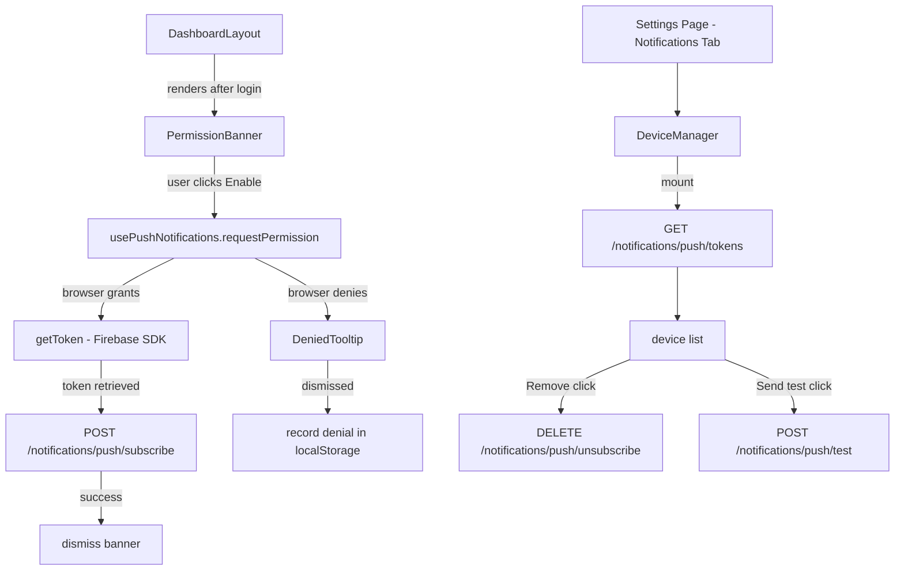

# Design Document: Push Notification Permission Management

## Overview

This feature adds browser push notification permission handling and FCM device token management to the MentorMinds frontend. The backend already exposes four endpoints (`POST /notifications/push/subscribe`, `DELETE /notifications/push/unsubscribe`, `GET /notifications/push/tokens`, `POST /notifications/push/test`). The frontend work covers three areas:

1. A non-intrusive **PermissionBanner** shown after first login that explains push notifications before triggering the browser dialog.
2. A **usePushNotifications** hook that encapsulates all browser Push API and FCM token logic.
3. A **DeviceManager** component embedded in the existing Settings → Notifications tab that lists registered devices, allows removal, and provides a test notification button.

The feature integrates with the existing `DashboardLayout`, `NotificationSettings`, and `useSettings` patterns already in the codebase. Firebase is loaded via the Firebase JS SDK (modular v9+). Permission state and dismissal flags are persisted in `localStorage` to avoid re-prompting across sessions.

---

## Architecture



### Key Design Decisions

- **No new context** — push notification state is managed locally in `usePushNotifications` and `DeviceManager`. The existing `NotificationContext` handles in-app toasts; push is a separate concern.
- **Firebase SDK loaded lazily** — `firebase/app` and `firebase/messaging` are imported only when the user clicks "Enable", keeping the initial bundle small.
- **localStorage flags** — `mm_push_banner_dismissed` (session-scoped via `sessionStorage`) and `mm_push_permission_state` (persistent) prevent re-prompting.
- **Device name from user-agent** — a small utility parses `navigator.userAgent` to produce a human-readable label (e.g. "Chrome on macOS").

---

## Components and Interfaces

### `usePushNotifications` hook

Central hook that owns all push-related logic.

```ts
interface UsePushNotificationsReturn {
  // Current browser permission state
  permissionState: NotificationPermission; // 'default' | 'granted' | 'denied'
  // Whether the banner should be shown
  showBanner: boolean;
  // Request browser permission and register FCM token
  requestPermission: () => Promise<void>;
  // Dismiss the banner without requesting permission
  dismissBanner: () => void;
  // Loading / error state for the subscribe call
  isRegistering: boolean;
  registrationError: string | null;
}
```

Internal flow of `requestPermission`:
1. Call `Notification.requestPermission()`.
2. If `'granted'`: call `getToken(messaging, { vapidKey })` from Firebase SDK.
3. Call `POST /notifications/push/subscribe` with `{ token, deviceName }`.
4. On success: persist `mm_push_permission_state = 'granted'` and dismiss banner.
5. On failure: set `registrationError`.
6. If `'denied'`: persist `mm_push_permission_state = 'denied'`, set `showDeniedTooltip = true`.

### `PermissionBanner` component

Rendered inside `DashboardLayout` just above the main content area, conditionally on `showBanner`.

```tsx
interface PermissionBannerProps {
  onEnable: () => void;
  onDismiss: () => void;
  isLoading: boolean;
  error: string | null;
}
```

- Styled as a dismissible top banner (similar to `CookieBanner` pattern).
- "Enable" button triggers `onEnable`; disabled while `isLoading`.
- "Not now" button triggers `onDismiss`.
- Error message shown inline below the buttons when `error` is set.

### `DeniedTooltip` component

A modal-style overlay (not a hover tooltip) shown when the browser permission is denied.

```tsx
interface DeniedTooltipProps {
  onDismiss: () => void;
}
```

- Displays browser-specific instructions for Chrome, Firefox, and Safari.
- Detects browser from `navigator.userAgent` and highlights the relevant section.
- Dismissed via a close button.

### `DeviceManager` component

Embedded in the existing `NotificationSettings` component as a new section.

```tsx
interface DeviceManagerProps {
  // no external props — self-contained, fetches its own data
}
```

Internal state:
- `devices: PushDevice[]`
- `loading: boolean`
- `error: string | null`
- `removingId: string | null`
- `testStatus: 'idle' | 'sending' | 'sent' | 'error'`

### `pushNotification.service.ts`

New service file that wraps the four backend endpoints.

```ts
interface PushDevice {
  token: string;
  deviceName: string;
  browser: string;
  lastActiveAt: string; // ISO date string
}

const pushNotificationService = {
  subscribe(token: string, deviceName: string): Promise<void>,
  unsubscribe(token: string): Promise<void>,
  getTokens(): Promise<PushDevice[]>,
  sendTest(): Promise<void>,
}
```

---

## Data Models

### `PushDevice`

```ts
interface PushDevice {
  token: string;       // FCM token (opaque string)
  deviceName: string;  // e.g. "Chrome on macOS"
  browser: string;     // e.g. "Chrome 124"
  lastActiveAt: string; // ISO 8601 date
}
```

### `PushSubscribeRequest`

```ts
interface PushSubscribeRequest {
  token: string;
  deviceName: string;
}
```

### localStorage / sessionStorage keys

| Key | Storage | Value | Purpose |
|-----|---------|-------|---------|
| `mm_push_permission_state` | localStorage | `'granted' \| 'denied'` | Prevent re-prompting after explicit decision |
| `mm_push_banner_dismissed` | sessionStorage | `'true'` | Hide banner for the rest of the current session after "Not now" |

### Firebase configuration

Firebase config values are read from Vite environment variables:

```ts
const firebaseConfig = {
  apiKey: import.meta.env.VITE_FIREBASE_API_KEY,
  projectId: import.meta.env.VITE_FIREBASE_PROJECT_ID,
  messagingSenderId: import.meta.env.VITE_FIREBASE_MESSAGING_SENDER_ID,
  appId: import.meta.env.VITE_FIREBASE_APP_ID,
};
const vapidKey = import.meta.env.VITE_FIREBASE_VAPID_KEY;
```

---

## Correctness Properties

*A property is a characteristic or behavior that should hold true across all valid executions of a system — essentially, a formal statement about what the system should do. Properties serve as the bridge between human-readable specifications and machine-verifiable correctness guarantees.*

### Property 1: Banner visibility matches permission and dismissal state

*For any* combination of prior permission decision (`'granted'`, `'denied'`, or absent) and session dismissal flag (set or absent), `usePushNotifications` should return `showBanner === true` if and only if no prior decision exists and the session dismissal flag is not set.

**Validates: Requirements 1.1, 1.4**

### Property 2: Dismissal suppresses banner for the session

*For any* call to `dismissBanner()`, the subsequent value of `showBanner` should be `false`, and `sessionStorage` should contain `mm_push_banner_dismissed = 'true'`.

**Validates: Requirements 1.3**

### Property 3: Subscribe call includes token and device name

*For any* FCM token string and any device name string, calling `pushNotificationService.subscribe(token, deviceName)` should issue a `POST /notifications/push/subscribe` request whose body contains both the `token` field and the `deviceName` field with the exact values provided.

**Validates: Requirements 2.3**

### Property 4: Device row completeness

*For any* non-empty list of `PushDevice` objects, the `DeviceManager` rendered output should contain, for each device, its device name, browser, last active date, and a "Remove" button.

**Validates: Requirements 4.2, 5.1**

### Property 5: Device list reflects removal

*For any* device list and any device in that list, after a successful `unsubscribe` call for that device's token, the device should no longer appear in the displayed list.

**Validates: Requirements 5.3**

### Property 6: Failed removal leaves list unchanged

*For any* device list and any device in that list, if the `unsubscribe` call fails, the device list should remain identical to its state before the removal was attempted.

**Validates: Requirements 5.4**

### Property 7: Device name derivation is deterministic

*For any* user-agent string, `deriveDeviceName(userAgent)` should always return the same non-empty string when called multiple times with the same input.

**Validates: Requirements 2.3**

### Property 8: Test button disabled while request is in-flight

*For any* device list, while the `POST /notifications/push/test` request is in-flight, the "Send test notification" button should have `disabled === true`.

**Validates: Requirements 6.5**

---

## Error Handling

| Scenario | Handling |
|----------|----------|
| `POST /notifications/push/subscribe` fails | Set `registrationError`; display inline error in `PermissionBanner`; do not dismiss banner |
| `GET /notifications/push/tokens` fails | Show error message + retry button in `DeviceManager` |
| `DELETE /notifications/push/unsubscribe` fails | Show inline error; leave device in list; clear `removingId` |
| `POST /notifications/push/test` fails | Set `testStatus = 'error'`; show error message; re-enable button |
| Browser does not support Push API | `usePushNotifications` returns `showBanner = false`; `DeviceManager` shows unsupported message |
| Firebase `getToken` throws | Treat as registration failure; set `registrationError` |
| Permission denied by browser | Show `DeniedTooltip`; persist denial in localStorage |

All API calls go through the existing `api.client.ts` Axios instance, which handles auth headers, retry on 5xx, and offline queuing automatically.

---

## Testing Strategy

### Unit tests

Focus on specific examples, integration points, and edge cases:

- `PermissionBanner` renders "Enable" and "Not now" buttons.
- `PermissionBanner` shows error message when `error` prop is set.
- `PermissionBanner` disables "Enable" button when `isLoading` is true.
- `DeniedTooltip` renders Chrome instructions when user-agent contains "Chrome".
- `DeniedTooltip` renders Firefox instructions when user-agent contains "Firefox".
- `DeniedTooltip` renders Safari instructions when user-agent contains "Safari".
- `DeviceManager` shows loading indicator while fetching.
- `DeviceManager` shows empty state when device list is empty.
- `DeviceManager` shows error + retry when `GET /tokens` fails.
- `pushNotificationService.getTokens` returns parsed `PushDevice[]`.

### Property-based tests

Using **fast-check** (already in `devDependencies`). Each test runs a minimum of 100 iterations.

**Property 1: Banner visibility matches permission and dismissal state**
```
// Feature: push-notification-permission-management, Property 1: Banner visibility matches permission and dismissal state
fc.assert(fc.property(
  fc.oneof(fc.constant('granted'), fc.constant('denied'), fc.constant(null)),
  fc.boolean(), // sessionStorage dismissed flag
  (priorDecision, sessionDismissed) => {
    // set mm_push_permission_state and mm_push_banner_dismissed accordingly
    // render hook, assert showBanner === (priorDecision === null && !sessionDismissed)
  }
), { numRuns: 100 });
```

**Property 2: Dismissal suppresses banner for the session**
```
// Feature: push-notification-permission-management, Property 2: Dismissal suppresses banner for the session
fc.assert(fc.property(
  fc.string({ minLength: 1 }), // arbitrary session context
  (_ctx) => {
    // render hook with default state, call dismissBanner()
    // assert showBanner === false and sessionStorage['mm_push_banner_dismissed'] === 'true'
  }
), { numRuns: 100 });
```

**Property 3: Subscribe call includes token and device name**
```
// Feature: push-notification-permission-management, Property 3: Subscribe call includes token and device name
fc.assert(fc.property(
  fc.string({ minLength: 10 }), // token
  fc.string({ minLength: 1 }),  // deviceName
  async (token, deviceName) => {
    // mock axios, call pushNotificationService.subscribe(token, deviceName)
    // assert request body contains { token, deviceName }
  }
), { numRuns: 100 });
```

**Property 4: Device row completeness**
```
// Feature: push-notification-permission-management, Property 4: Device row completeness
fc.assert(fc.property(
  fc.array(fc.record({ token: fc.string({ minLength: 5 }), deviceName: fc.string({ minLength: 1 }), browser: fc.string({ minLength: 1 }), lastActiveAt: fc.string() }), { minLength: 1 }),
  (devices) => {
    // render DeviceManager with devices
    // for each device, assert deviceName, browser, lastActiveAt, and Remove button are present
  }
), { numRuns: 100 });
```

**Property 5: Device list reflects removal**
```
// Feature: push-notification-permission-management, Property 5: Device list reflects removal
fc.assert(fc.property(
  fc.array(fc.record({ token: fc.string({ minLength: 5 }), deviceName: fc.string(), browser: fc.string(), lastActiveAt: fc.string() }), { minLength: 1 }),
  fc.nat(),
  (devices, indexSeed) => {
    const idx = indexSeed % devices.length;
    // render DeviceManager with devices, mock unsubscribe to succeed
    // click Remove for devices[idx], assert devices[idx].token no longer in rendered list
  }
), { numRuns: 100 });
```

**Property 6: Failed removal leaves list unchanged**
```
// Feature: push-notification-permission-management, Property 6: Failed removal leaves list unchanged
fc.assert(fc.property(
  fc.array(fc.record({ token: fc.string({ minLength: 5 }), deviceName: fc.string(), browser: fc.string(), lastActiveAt: fc.string() }), { minLength: 1 }),
  fc.nat(),
  (devices, indexSeed) => {
    const idx = indexSeed % devices.length;
    // render DeviceManager with devices, mock unsubscribe to reject
    // click Remove for devices[idx], assert list length === devices.length
  }
), { numRuns: 100 });
```

**Property 7: Device name derivation is deterministic**
```
// Feature: push-notification-permission-management, Property 7: Device name derivation is deterministic
fc.assert(fc.property(
  fc.string({ minLength: 1 }),
  (userAgent) => {
    const name1 = deriveDeviceName(userAgent);
    const name2 = deriveDeviceName(userAgent);
    return name1 === name2 && name1.length > 0;
  }
), { numRuns: 100 });
```

**Property 8: Test button disabled while request is in-flight**
```
// Feature: push-notification-permission-management, Property 8: Test button disabled while request is in-flight
fc.assert(fc.property(
  fc.array(fc.record({ token: fc.string({ minLength: 5 }), deviceName: fc.string(), browser: fc.string(), lastActiveAt: fc.string() }), { minLength: 1 }),
  (devices) => {
    // render DeviceManager with devices, mock sendTest to never resolve
    // click "Send test notification", assert button has disabled attribute
  }
), { numRuns: 100 });
```
